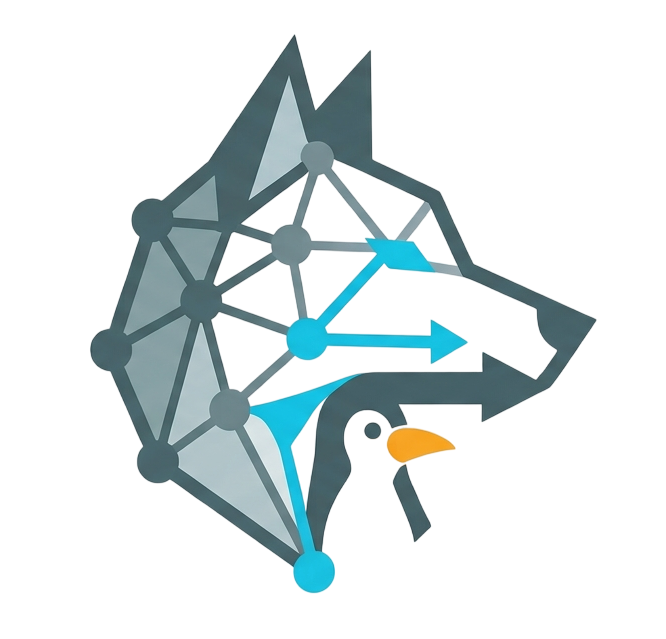

# Lycan

Lightweight PWA manager for Linux. Turn any website into a desktop application with minimal resource overhead.

Lycan uses [wry](https://github.com/tauri-apps/wry) (WebKitGTK) to run web apps in standalone windows, generates `.desktop` files for menu integration, and includes a built-in ad/tracker blocker. Each PWA gets its own on-disk profile so logins and site data persist between launches.

## Features

- **TUI** — add, edit, delete, search PWAs (`lycan` with no arguments)
- **CLI** — `lycan open <app-name>`, `lycan detect-system`, `lycan --help` / `--version`
- **Persistent sessions** — per-app WebKit data under `apps/<id>/webview/` (cookies, storage, cache)
- **Private data layout** — app directories and `config.json` use restrictive Unix permissions (`0700` / `0600`) where supported
- **Automatic favicon fetching** from the site URL
- **`.desktop` files** for rofi, dmenu, and application menus
- **Ad/tracker blocking** — in-page hooks on `fetch`, `XMLHttpRequest`, and `sendBeacon` for 35+ common ad/tracking domains
- **WebKit tuning profile** — `~/.local/share/lycan/webkit-tuning.json` is created on first run from GPU/session heuristics (e.g. DMA-BUF workaround on NVIDIA; optional compositing hints on Wayland + NVIDIA). Re-run after hardware or session changes with `lycan detect-system`
- **Performance-oriented defaults** — WebKit `Settings` tuned for GPU use, DNS prefetch, page cache, media; developer tools only in debug builds
- **Optional environment overrides** — `LYCAN_WEBKIT_DISABLE_DMABUF`, `LYCAN_WEBKIT_DISABLE_COMPOSITING` (see `lycan --help`)
- **X11 and Wayland** — no forced GDK backend; works on both when your GTK/WebKit stack does

## Dependencies

- `gtk3`
- `webkit2gtk` (pulled in by wry)
- `glib2`

## Installation

### Arch Linux (AUR)

```
yay -S lycan-bin
```

### Build from source

```
git clone https://github.com/tutkuofnight/lycan.git
cd lycan
cargo build --release
cp target/release/lycan ~/.local/bin/
```

## Usage

Show all commands and options:

```
lycan --help
```

Launch the TUI to manage your PWAs:

```
lycan
```

Open an existing PWA by its **app name** (same as the folder name under `apps/`):

```
lycan open <app-name>
```

After changing GPU, drivers, or switching between X11 and Wayland, refresh WebKit hints:

```
lycan detect-system
```

### TUI keybindings

| Key | Action |
|-----|--------|
| `a` | Add new PWA |
| `e` | Edit selected PWA |
| `o` / `Enter` | Open selected PWA |
| `d` | Delete selected PWA |
| `/` | Search / filter |
| `j` / `k` | Navigate up / down |
| `q` | Quit |

## How it works

When you add a PWA, Lycan:

1. Fetches the favicon from the URL and saves it locally
2. Creates a directory `~/.local/share/lycan/apps/<app-name>/` with `config.json` (and later `webview/` when you open it)
3. Writes a `.desktop` file under `~/.local/share/applications/`

On first `lycan` or `lycan open`, if missing, **`webkit-tuning.json`** is written next to `apps/` with WebKit-related flags inferred from your system.

When you open a PWA, Lycan starts a GTK window with a wry WebView, a **persistent** WebKit context rooted at `apps/<app-name>/webview/`, a Chrome-like user agent for compatibility, and the blocker initialization script. Release builds do not enable the Web Inspector.

## Configuration

Data lives under **`$XDG_DATA_HOME/lycan`** (usually `~/.local/share/lycan/`):

```
~/.local/share/lycan/
├── webkit-tuning.json          # GPU / session hints (regenerate: lycan detect-system)
└── apps/
    ├── whatsapp/
    │   ├── config.json
    │   ├── icon.png
    │   └── webview/            # WebKit profile (created on first open)
    └── youtube/
        ├── config.json
        └── icon.png
```

Deleting a PWA from the TUI removes its entire `apps/<app-name>/` tree (including `webview/`).
